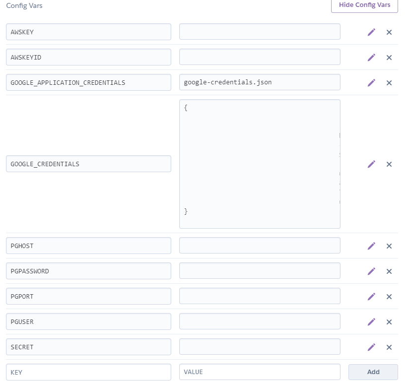

[Deliverable 2 README](deliverables/deliverable-2)

# About

Scribe is a web application targetted to medical students taking notes during patient interviews. Students are able to take notes via keyboard or stylus and have their recorded information parsed and sent for analysis. Course instructors are able to view the student's notetaking process as Isabel (a differential diagnosis tool) suggests possible diagnosies for a given patient. This application was developed alongside Harvard Medical School and University of Toronto Computer Science graduate researchers.

# Notes

Please use Google Chrome when accessing this project.
We were never able to test this project on a real tablet - a tablet-like mode can be simulated on Google Chrome by pressing `F12` and then `ctrl + shift + M` and selecting "iPad" or "iPad Pro" from the dropdown near the top of the screen. This is how we tested our views for "tablet" use. iPad and iPad Pro are the only two mobile settings we tested the views on. This means that visiting the website on a phone which has much less screen space will likely have poor results.

# Issues/Bugs

* While in tablet-mode, dragging to resize the canvas is extremely finicky and pretty much does not work. It works fine on desktop.
* Canvases don't save when you draw on them in tablet mode - only in desktop mode. This is counter-intuitive and we realize this, but for whatever reason this part was not completed.

# Items not completed

* With regards to templates, you can only enable/disable and reorder top level pages, not the individual components of the page.
* We could not end up implementing the export patient profile as PDF.

# Getting Started

This is a guide to running this project on your local host. Run the following to get started.

```bash
git clone https://github.com/csc301-winter-2020/team-project-4-harvard-medical-school.git
cd team-project-4-harvard-medical-school
npm install
touch .env
touch gcp_credential.json
```

You will need to paste the contents of the supplied `.env` file into the created `.env` file. Same goes for the `gcp_credential.json` file. 

Look through the `.env` file, it is very likely you will have to change the database credentials to work on your own database. This project uses PostgreSQL. The `GOOGLE_APPLICATION_CREDENTIALS` is an absolute path that you will definitely have to change.

Once these configuration files are filled out, you may type `npm run dev` to start the application. Doing so will build the project and attempt to start the development server on your local host simulataneously. Your other option is to run `npm run build` to build the app and then `npm run start` to start the app. This will not run webpack in watch mode, meaning that changes to files will not cause the Typescript compiler to recompile the project, which would be the case if you were to use `npm run dev`.

This project is written in TypeScript and compiled into JavaScript during the build process. To be clear, the application is looking for the files `server.js` in the `/dist` folder and `app.js` in the `/public/js` folder. If they aren't there, nothing will run. That is where the typescript compiler and webpack come in, they compile all the front-end `*.tsx` files into one `app.js` file. These files are found in the `/src/client` folder. In a similar fashion, all the back-end `*.ts` files are compiled into a single `server.js` file, and these files can be found in the `/src/server` folder.

Server will start on port 3000. If you ran `npm run dev`, then it is likely the first time that the server will fail since it is looking for files that have not yet compiled (`server.js` and `app.js`). The first time running the command, it will take some time to compile all the files (there are a lot). After this, any changes you make to a file will cause the Typescript compiler to re-compile the project on file save. This process can be very quick or take a good number of seconds depending on the speed of your computer.

# Deployment

Heroku will automatically deploy the app to `https://csc301-scribe.herokuapp.com/` when you push to the master branch (on our private github repo). If you wish to deploy this to another Heroku app, then you can setup automatic deployment via Heroku or you can login via Heroku CLI and `git push heroku master` to deploy the project.

Do note that since the `.env` and `gcp_credential.json` are `.gitignore`'d that they will not be visible to Heroku on the build. You will have to manually set these in `Heroku > Settings > Config Vars > Reveal Config Vars` and set them appropriately as they are set in the `.env` file. What we did was just copy over all the values from the `.env` file into the values section for each respective key. The `GOOGLE_CREDENTIALS` section is just JSON data.



Relevant values have been removed from the above picture.

# Database & Google Vision
Database connection has been set up. The following environmental variable must be defined in `.env` 
for the server to run.

`PGUSER`: User name of the database connection 

`PGHOST`: IP address of the database
 
`PGPASSWORD`: Password of the database
 
`PGDATABASE`: Name of the database you want to connect

The information above will be posted in slack channel @private and it will be pined. The server will 
be shutdown if no one is using it. Let `@Qingyuan Qie` know if you can not connect to the database.

In addition, the Google Cloud Vision API need a environmental variable `GOOGLE_APPLICATION_CREDENTIALS`, which is a
path to a json file that stored the credential. The credential file will be posted in Slack `@private` Channel.

# Connecting to the Database by Database Client (Windows)

This section is for accessing the project's database using a client, for example if you wished to run queries on our database to view the data.

1. Download [HeidiSQL](https://www.heidisql.com/download.php) or your choice of client.
2. Then click new session in bottom left
3. Network type: postgreSQL tcp/ip
4. Library: libpq-10.dll
5. Hostname: Find this in the `.env` file supplied to you from another dev.
6. User: Find this in the `.env` file supplied to you from another dev.
7. Password: Find this in the `.env` file supplied to you from another dev.
8. Port: 5432
9. Database: postgres
10. Click open
11. Click the tab that says "Query" with the play button
12. Paste in your .sql query file
13. Click the play button in the bar at the top to run the query

# AWS S3
AWS S3 requires yet two more environmental variables.
`AWSKEYID`: This is the ID of the aws access key.
`AWSKEY`: This is the key of the corresponding ID.

Please see Slack Channel @private for the values.
